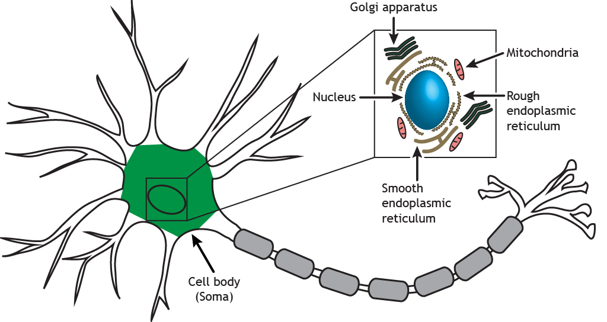

Well organised Intro to NeuroScience and the topics that are covered in the next sections.

## Vocabulary used in the Video

* **Cortex**: outer hard layer of the brain
* **Cerebral**: relating to the "brain"
* **Occipital Lobe**: the rearmost lobe in each cerebral hemisphere of the brain.
* **Somatosensory** : of or pertaining to sense or sensation, conveying sensation.

## Notes

### Brain vs the Mind
- **brain**: is the hardware, the physical part. Since the brain(hardware) consumes around 20% of body oxygen, it might be doing something imp.
- **mind**: Software, find patterns, instruction set and algo. Somehow the dynamics/interactions of the hardware gives rise to the **mind**.
### Functional Division
- Brain can be divided by the function on the cortex. Common areas consist of: **Visual Cortext in the Occipital Lobe, Auditory Cortex, Somatosensory Cortex.**
- Sub cortical regions: older regions by evolution
### Neurons
- Functional understanding on higher level is not enough
- In order to understand how the hardware interplay might lead to thoughts(mind) we need to understand the smallest unit of brain: **Neurons**
- Structurally Neurons like most cells have a Nucleus and Other cell bodies. Most important parts of a Neuron are the **Axon**: *Send ourputs to other other Neurons* and the **Dendrites**: *receive inputs from other Neurons*.

|:--:|
| <b>Image Credits - [Foundations of Neuroscience by Casey Henley](https://openbooks.lib.msu.edu/neuroscience/)</b>|

- Action Potential 
    - Is the currency of information processing in the brain
    - Neurons of different type tends to speak a language of sorts by their spiking(firing) patterns.
    - Number/diversity does not matter as for example, an Elephant has ~3 times more neurons than Humans, it's the connections and their strength that leads to the complexity of the brain.
- Connections b/w Neurons: **Electrical & Chemical**
- Synapse:
    - is a chemical connection
    - is more abundant than the electrical one
- **NeuroTransmitters** define excitatory or inhibitory neuron
- **Dale's Dogma**: Neurons can be either Ext/Inh

### Network of Neurons
- NeoCortex
    - layered architecture:6 layers
    - Vertically layers are not connected in order
    - Horizontally, the neurons connections are distance based and over long distance they make "patchy: in small areas" connections
 - Between regions connectivity chart which shows that the connections have some structure to them.
 - Brain complexity arises from the strength and number of the connections, these connections strength can change
 - Brain can be thought of as a Net of Net, Local regions make a net which connects to other nets giving rise to function
 - **Question: Can a neuron connect to new neurons or does the connections remain static i.e only their strength changes?**

### Brain Function
- Behavior to brain activity gives some idea about the brain function
- Relate to Machine learning: Reinforcement Learning

### Measuring Brain Activity
Various ways to read our Brain Activity, for example: **fMRI, MEG & EEG etc.** provides different time and spatial resolution.

### Video Lecture

<iframe width="700" height="350" src="https://youtube.com/embed/mZkujcMW1uI" frameborder="0" 
allow="accelerometer; autoplay; encrypted-media; gyroscope; picture-in-picture" 
allowfullscreen>
</iframe>

### Slides

<iframe width="730" height="410" src="https://mfr.ca-1.osf.io/render?url=https://osf.io/96dqp/?direct%26mode=render%26action=download%26mode=rende" frameborder="0" allowfullscreen=""></iframe>